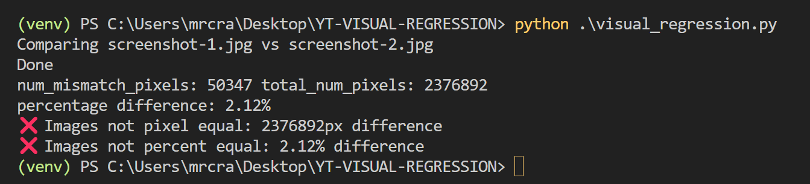

# Visual Regression

Given two images screenshot-1.jpg and screenshot-2.jpg, `visual_regression.py` will produce two images:

- `diff__pil_screenshot-1.jpg__v__screenshot-2.jpg_1288.png` shows highlights difference.
- `diff_pixelmatch_screenshot-1.jpg__v__screenshot-2.jpg_7152.png` is an image just of the difference.

`visual_regrssion.py` is customisable and outputs the following:

For a test, we can set levels of difference either by pixels or percentage:

